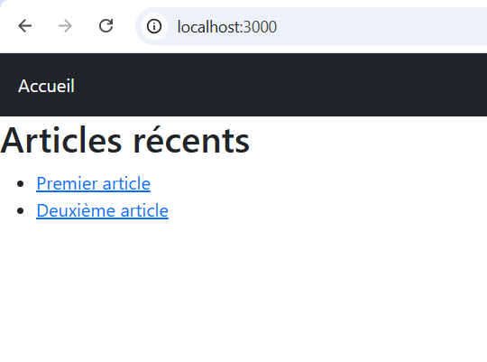
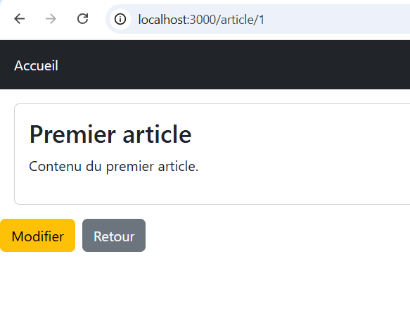
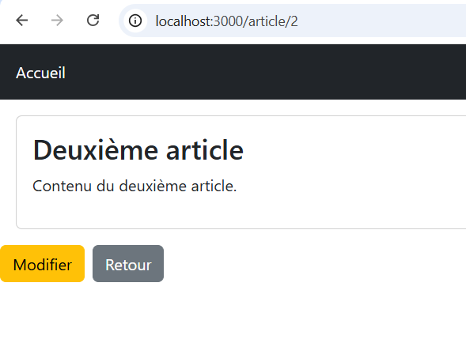
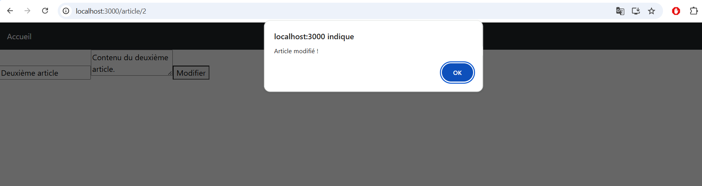
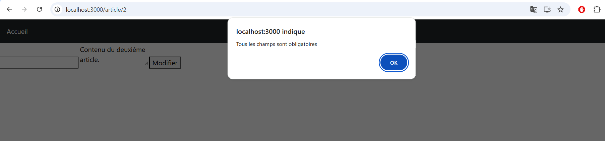

# TP React – Blog Simple avec Navigation

## 📌 Description

Ce projet est une application React permettant de créer un **blog simple**.  
On peut afficher des articles, voir leur détail et les modifier.

---

## 🛠 Technologies utilisées

- React  
- React Router  
- Bootstrap  
- useState  

---

## ▶️ Lancer le projet

```bash
npm install
npm start
```
Ouvrir : http://localhost:3000

---

## 🧪 Fonctionnement

Navigation entre les pages avec React Router

Liste d’articles affichée avec map()

Détail d’un article avec useParams()

Modification avec un formulaire (useState)

---

## 🌐 Live Demo

👉 Lien de l’application en ligne : 

https://simpleblog-malakintech.netlify.app/


---

## 📸 Screenshots


---

---

---

---



---

## Auteur
- Nom : Malak El Mallouky
- Filliere : SIR
